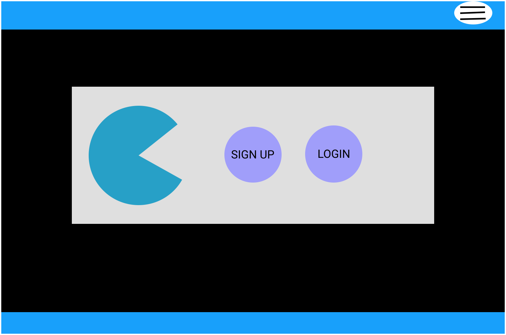
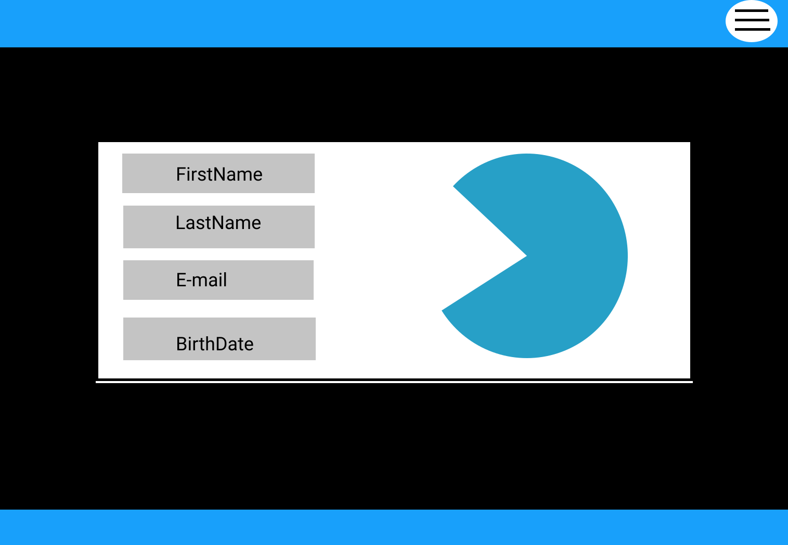
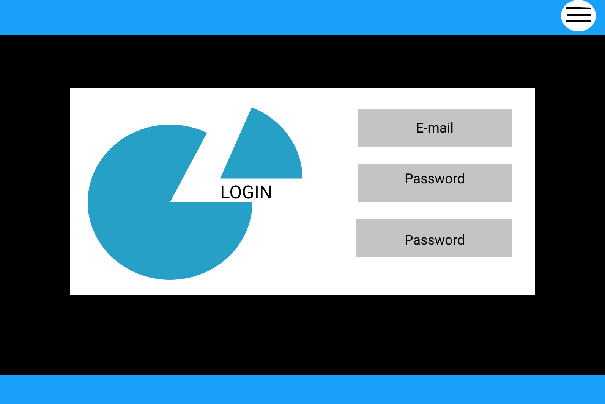
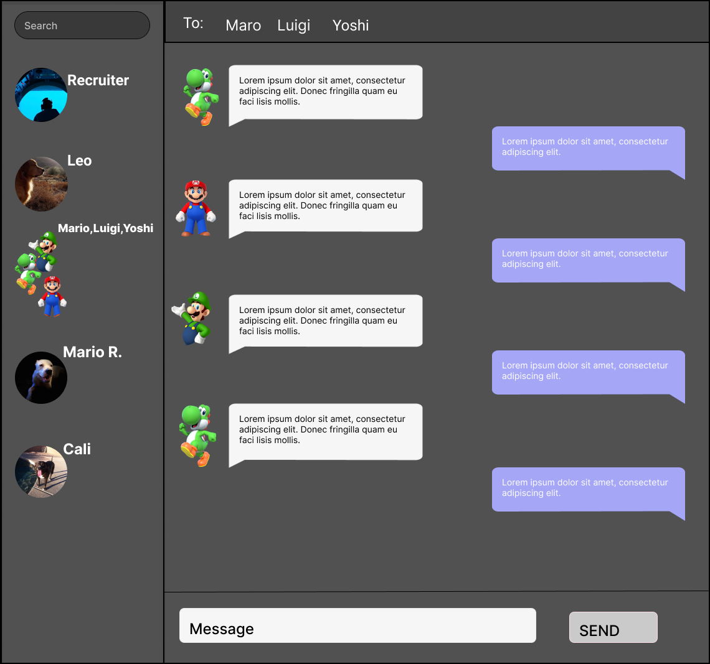

## RealTaalk

RealTaalk is a chat app allowing users to stay connected world wide.

## Motivation

Connecting users through chat rooms and understanding websockets while learning the hard parts of Node.js.

## Technologies Used

JavaScript
Node.js
Express
React.js
PostgreSQL
GraphQL
Apollo
Socket.io
HTML
CSS

##### Screenshot(s)

## Future Development

Future plans will include allowing the user to save threads,send different file types and customize chat rooms.
